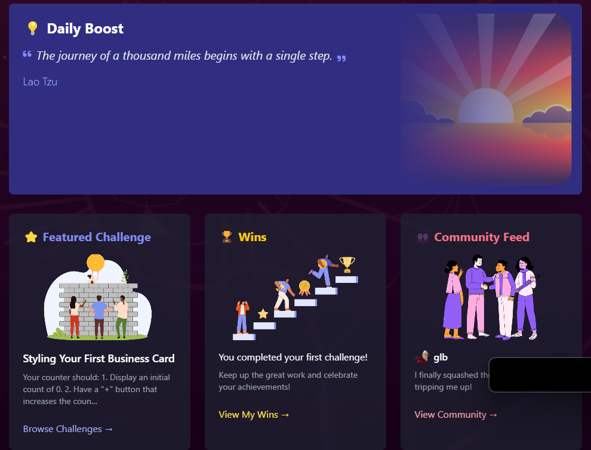

# Boost.dev  <a id="top"/>

 

## Introduction

This project was made for the April Hackthon - "Unmask The Coder" by Code Institute.<br>
It aims to show users that they have good skills and to help dealing with Imposter Syndrome.<br>
The idea for the project came from one of the members and was consistent with the suggested projects by CI - Hack Team.<br>
Incorporating more than one idea of those suggested.<br>

Live site: [Boost.dev](https://boost-dev-9ed56bf6f182.herokuapp.com/)

## Table of Contents
- [Boost.dev](#boostdev)
    - [Introduction](#introduction)
    - [Table of Contents](#table-of-contents)
    - [Overview](#overview)
- [Ux - User Experience](#ux---user-experience)
    - [Colour Scheme](#colour-scheme)
    - [Contrast Check](#contrast-check)
    - [Typography](#typography)
- [Project Planning](#project-planning)
    - [Strategy](#strategy)
    - [Agile Methodologies](#agile-methodologies)
    - [Users](#users)
    - [Wireframes](#wireframes)
    - [Imagery](#imagery)
    - [Features](#features)
- [Technologies Used](#technologies-used)
    - [Languages and Technologies](#languages-and-technologies)
    - [Libraries](#libraries)
    - [Tools and Programs](#tools-and-programs)
- [Deployment](#deployment)
    - [Connecting to GigHub](#connecting-to-github)
    - [Django Project Setup](#django-project-setup)
    - [Cloudinary API](#cloudinary-api)
    - [Heroku Deployment](#heroku-deployment)
    - [Clone Project](#clone-project)
    - [Fork Project](#fork-project)
    - [Tailwind](#tailwind-css-setup)
      - [Prerequisits](#prerequisites)
      - [Installation](#installation)
- [Bugs to fix](#bugs-to-fix)
- [AI Implementation and Orchestration](#ai-implementaion-and-orchestration)
    - [Code Generation](#code-generation)
    - [Debugging](#debugging)
    - [Code Optimization](#code-optimisation)
    - [Impact on Workflow](#impact-on-workflow)
- [Testing](#testing)
    - [HTML Validation](#html-validation)
    - [CSS Validation](#css-validation)
    - [Lighthouse Audit](#lighthouse-audit)
    - [Manual Testing](#manual-testing)
- [Future Features](#future-features)
- [Credits](#credits)
    - [Code References](#code-references)
    - [Media References](#media-references)
    - [Acknowledgments](#acknowledgements)
    - [Owner Details](#owner-details)


[Back to top](#top)

# Overview
Boost.dev is a simple site with information about Imposter Syndrome that many developers can go through with different symptoms, and it aims to provide information about this subject and also present ideas about how the user can try to overcome this.<br>

It's meant to be an interactive and responsive site.

  - Users have access to posts related to the main subject
  - Users can do coding challenges in different levels

The site is designed to be responsive in different screen sizes.

Our main goal is to let the user know that they are great developers and hopefully to let them improve their confidence with coding and to help others in similar situation, creating a supporting community for developers that have low-confidence.

## UX - User Experience
This project was inspired in 2 sites:

  - [daily.dev](https://daily.dev/)
  - [gamma.app](https://gamma.app/docs/boostdev-Where-Confidence-Grows-ltxw0nuvix1u7ue?mode=doc)

Fiirst site was known to one of the members of the group and the second is a template made by the same member about Imposter Syndrome.

As the look seemed well put and  a great start, the steam thought about taking this idea and changing it with inspiration also on "daily.dev" for the main site after the user registers or logs in the site.

We took the same name, and developed a different landing page and worked on the main site, providing some information for the user even before he registers on the site.

We opted for a simple and minimalistic layout and logo and to focus more on the content to get the attention for the issue that the "Imposter Syndrome" can present to the user and hoepfully make him/her feel encouraged to register, improve his/her confidence, as well as to try to overcome it and help others while also improving his/her skills.

[Back to top](#top)

## Colour Scheme
Following the initial idea from our colleague, we used similar colours to the ones used on "boost.dev" and adapted as necessary for better contrast, tryin gto keep it simple.

Colours - checked against WCAG for contrast 

#581CA0 - Purple (from the canva mind map)<br>
#312fa6 - Indigo<br>
#b12e5d - Roseberry<br>
#0088cc - Bright blue<br>
#121212 - Dark background<br>
#ffffff - White<br>

<br>

| Colour      | WCAG Ratio (against #121212) | WCAG Contrast          |
|-------------|-------------------------------|-------------------------|
| Purple      | Pass (7.1:1)                 | ✅ AAA                 |
| Indigo      | Pass (8.23:1)                | ✅✅ AAA               |
| Roseberry   | Pass (6.71:1)                | ✅✅ AAA               |
| Bright Blue | Pass (6.95:1)                | ✅✅ AAA               |

## Contrast Check
<br>

## Typography
Fonts used for this website were:

  - [open sans](https://fonts.google.com/specimen/Open+Sans)
  - [Segoe UI](https://learn.microsoft.com/en-us/typography/font-list/segoe-ui)
  - [Helvetica-Neue](https://www.cdnfonts.com/helvetica-neue-5.font)

[Back to top](#top)

# Project Planning

The main goal for this project was to create a site that feels friendly, invitting and can provide users the feeling that they are good developers, although they might not see themselves in that way.<br>

## Strategy

  - User-friendly platform to post artwork
  - Appealing and minimalistic layout and colors
  - Show simple and easy to select menus
  - Ensure consistent UX thoughout multiple platforms, as mobile devices, tablets, and desktops
  - Develop a platform that can be improved with new features in the future

## Agile Methodologies
Boost.dev was the first hackathon with people from different courses for one of our members and a review for the rest of the group, although in the begining we started getting roles, during the project, each one of us got to manage and push the others at different times, with discussions about different features happening throughout the process and all members having the opportunity to express their views.

Issues and features can be seen on [GitHub Project Board](https://github.com/users/Lochy2000/projects/7).

With each iteration of the Agile methogologies, the website was improved and we did our best to improve our skills and knowledge of the project management, which we had used in previous projects, but that can always be improved.

These will also be very important for future projects, either personal or professional, with Hackathons being a great way to also get more practice with Agile methodologies.

[Back to top](#top)

### Users
User Persona 1: Alice - The Aspiring Developer<br>
Age: 22<br>
Occupation: Computer Science Student<br>
Experience Level: Beginner<br>
Goals:
- Learn coding best practices and improve her programming skills.
- Build confidence in her abilities as a developer.
Connect with a supportive community of developers.

Challenges:
- Struggles with imposter syndrome and doubts her skills.
- Finds it difficult to stay motivated without external encouragement.
- Overwhelmed by the vast amount of online resources.

How Boost.dev Helps:
- Provides beginner-friendly coding challenges to help her practice.
- Offers a supportive community where she can share her progress and seek advice.
- Features articles and resources to help her overcome imposter syndrome.

User Persona 2: Ben - The Mid-Level Developer<br>
Age: 30<br>
Occupation: Frontend Developer at a Startup<br>
Experience Level: Intermediate<br>
Goals:
- Sharpen his coding skills and learn new technologies.
- Showcase his personal projects to gain recognition.
- Mentor junior developers and give back to the community.

Challenges:
- Wants to transition into a full-stack role but lacks backend experience.
- Feels stuck in his current role and wants to grow professionally.
- Struggles to find a platform to share his work and get feedback.

How Boost.dev Helps:
- Provides intermediate-level challenges to expand his skill set.
- Allows him to showcase his projects and receive constructive feedback.
- Offers opportunities to help beginners and share his knowledge.

User Persona 3: Clara - The Experienced Mentor<br>
Age: 40<br>
Occupation: Senior Software Engineer at a Tech Company<br>
Experience Level: Advanced<br>
Goals:
- Mentor and inspire the next generation of developers.

Challenges:
- Limited time to contribute to open-source projects or mentor in person.
- Wants to find a platform where she can make a meaningful impact.
- Needs a way to share her expertise without overwhelming her schedule.

How Boost.dev Helps:
- Provides a platform to mentor developers through forums and discussions.
- Helps her stay connected with the developer community and trends.

[Back to top](#top)

### Wireframes
Initial wireframes for desktop view as follows:


The initial concept was based on:

  - [daily.dev](https://daily.dev/)
  - [gamma.app](https://gamma.app/docs/boostdev-Where-Confidence-Grows-ltxw0nuvix1u7ue?mode=doc)

After the initial concept was drawn, the team decided to use a navbar on the top that changes to a "hamburger" dorpdown menu on smaller screens.<br>

[Back to top](#top)

### Imagery
Background image is an edited version of Ubuntu OS background page

  - [Ubuntu background](https://www.lebigdata.fr/wp-content/uploads/2021/07/Desktop_Ubuntu_20.04.png)

Other images searched on Google and adapted to use on the webiste, include:

  - [Cat Imposter Syndrome](https://londonmumsmagazine.com/wp-content/uploads/2015/02/imposter-syndrome-cats.jpg)
  - [3 C's imposter syndrome](https://www.dynamictransitionsllp.com/wp-content/uploads/2022/09/3-Cs-Image-1200x675.jpg)
  - [Female IS](https://images.herzindagi.info/image/2022/Oct/syndrome.jpg)
  - [Male IS](https://www.the-dentist.co.uk/media/ucnbkru2/suffering-from-imposter-syndrome.jpg)

[Back to top](#top)

## Features
Some of the features that can be seen on the website are:

An area where the user can do challenges created by AI and APIs with different levels of difficulty:<br>


A space to engage with the community:<br>


[Back to top](#top)

Landing page with information about Imposter Syndrome and Strategies to try to overcome it, also hopping the user will want to register on the site and get support and improve himself and maybe help other developers in a similar situation:<br>


Recent challenges doneby the user for other users to see:<br>



Area where the user can post wins achieved on that day or previously:<br>


An intuitive navbar with the main areas that the user can access:


Area with different resources related to Tech:<br>


[Back to top](#top)

## Technologies Used
### Languages and Technologies
  - HTML
  - CSS
  - JavaScript
  - Python
  - PostgreSQL
  - Git
  - Github
  - VS-Code
  - Django
  - Cloudinary
  - Heroku

### Libraries
  - Bootstrap v5.2.3
  - Django v3.2.19
  - Django AllAuth v0.54.0
  - Django Crispy Forms v2.0
  - Google Fonts
  - Crispy Bootstrap5 v0.7
  - Django Summernote v0.8.2
  - Pillow v9.5

### Tools and Programs
  - Balsamiq wireframe
  - MSCopilot AI
  - VS-Code Copilot
  - ChatGPT

[Back to top](#top)

## Deployment

### Connecting to GitHub
To begin this project from scratch, you must first create a new GitHub repository using the Code Institute's Template. This template provides the relevant tools to get you started. To use this template:

  - Log in to GitHub or create a new account.<br>
  - Navigate to the above CI Full Template.<br>
  - Click 'Use this template' -> 'Create a new repository'.<br>
  - Choose a new repository name and click 'Create repository from template'.<br>
  - In your new repository space, click the purple CodeAnywhere (if this is your IDE of choice) button to generate a new workspace.<br>

[Back to top](#top)

### Django Project Setup<br>
Install Django and supporting libraries:<br>
  - pip3 install 'django<4' gunicorn<br>
  - pip3 install dj_database_url psycopg2<br>
  - pip3 install dj3-cloudinary-storage<br>

Once you have installed any relevant dependencies or libraries, such as the ones listed above, it is important to create a requirements.txt file and add all installed libraries to it with the pip3 freeze --local > requirements.txt command in the terminal.

Create a new Django project in the terminal django-admin startproject ems .

Create a new app eg. python3 mangage.py startapp events

Add this to list of INSTALLED_APPS in settings.py - 'booking',

Create a superuser for the project to allow Admin access and enter credentials: python3 manage.py createsuperuser

Migrate the changes with commands: python3 manage.py migrate

An env.py file must be created to store all protected data such as the 
DATABASE_URL and SECRET_KEY. These may be called upon in your project's settings.py file along with your Database configurations. The env.py file must be added to your gitignore file so that your important, protected information is not pushed to public viewing on GitHub. For adding to env.py:

  - import os
  - os.environ["DATABASE_URL"]="<copiedURLfrom postgresql://neondb_owner>"
  - os.environ["SECRET_KEY"]="my_super^secret@key"

For adding to settings.py:

  - import os
  - import dj_database_url
  - if os.path.exists("env.py"):
  - import env
  - SECRET_KEY = os.environ.get('SECRET_KEY') (actual key hidden within env.py)

Replace DATABASES with:

DATABASES = {<br>
    'default': dj_database_url.parse(os.environ.get("DATABASE_URL"))<br>
  }

Set up the templates directory in settings.py:
  - Under BASE_DIR enter TEMPLATES_DIR = os.path.join(BASE_DIR, ‘templates’)
  - Update TEMPLATES = 'DIRS': [TEMPLATES_DIR] with:<br>
  os.path.join(BASE_DIR, 'templates'),<br>
  os.path.join(BASE_DIR, 'templates', 'allauth')<br>
  - Create the media, static and templates directories in top level of project file in IDE workspace.<br>
  
A Procfile must be created within the project repo for Heroku deployment with the following placed within it: web: gunicorn ems.wsgi

Make the necessary migrations again.

[Back to top](#top)

### Cloudinary API
Cloudinary provides a cloud hosting solution for media storage. All users uploaded images in the FreeFid project are hosted here.

Set up a new account at Cloudinary and add your Cloudinary API environment variable to your env.py and Heroku Config Vars. In your project workspace:

  - Add Cloudinary libraries to INSTALLED_APPS in settings.py
  - In the order:<br>
   'cloudinary_storage',<br>
   'django.contrib.staticfiles',  <br>
   'cloudinary',<br>

  - Add to env.py and link up with settings.py: os.environ["CLOUDINARY_URL"]="cloudinary://...."
  - Set Cloudinary as storage for media and static files in settings.py:
  - STATIC_URL = '/static/'<br>
  STATICFILES_STORAGE = 'cloudinary_storage.storage.StaticHashedCloudinaryStorage'<br>  
  STATICFILES_DIRS = [os.path.join(BASE_DIR, 'static'), ]<br>
  STATIC_ROOT = os.path.join(BASE_DIR, 'staticfiles')‌<br>  
  MEDIA_URL = '/media/'<br>  
  DEFAULT_FILE_STORAGE = 'cloudinary_storage.storage.MediaCloudinaryStorage'<br>

[Back to top](#top)

### Heroku deployment
To start the deployment process , please follow the below steps:

  - Log in to Heroku or create an account if you are a new user.

  - Once logged in, in the Heroku Dashboard, navigate to the 'New' button in the top, right corner, and select 'Create New App'.

  - Enter an app name and choose your region. Click 'Create App'.

  - In the Deploy tab, click on the 'Settings', reach the 'Config Vars' section and click on 'Reveal Config Vars'. Here you will enter KEY:VALUE pairs for the app to run successfully. The KEY:VALUE pairs that you will need are your:<br>
CLOUDINARY_URL: cloudinary://....<br>
DATABASE_URL:postgres://...<br>
DISABLE_COLLECTSTATIC of value '1' (N.B Remove this Config Var before deployment),<br>
PORT:8000<br>
SECRET_KEY and value<br>

  - Add the Heroku host name into ALLOWED_HOSTS in your projects settings.py file ->  ['800-nielmc-django-project-lxqprmm3qz.us2.codeanyapp.com', '.herokuapp.com', 'localhost', '127.0.0.1'].

  - Once you are sure that you have set up the required files including your requirements.txt and Procfile, you have ensured that DEBUG=False, save your project, add the files, commit for initial deployment and push the data to GitHub.

  - Go to the 'Deploy' tab and choose GitHub as the Deployment method.

  - Search for the repository name, select the branch that you would like to build from, and connect it via the 'Connect' button.

  - Choose from 'Automatic' or 'Manual' deployment options, I chose the 'Manual' deployment method. Click 'Deploy Branch'.

  - Once the waiting period for the app to build has finished, click the 'View' link to bring you to your newly deployed site. If you receive any errors, Heroku will display a reason in the app build log for you to investigate. DISABLE_COLLECTSTATIC may be removed from the Config Vars once you have saved and pushed an image within your project, as can PORT:8000.

[Back to top](#top)

### Clone project
A local clone of this repository can be made on GitHub. Please follow the below steps:

  - Navigate to GitHub and log in.
  - Kids Art Repository can be found at this location.
  - Above the repository file section, locate the 'Code' button.
  - Click on this button and choose your clone method from HTTPS, SSH or GitHub CLI, copy the URL to your clipboard by clicking the 'Copy' button.
  - Open your Git Bash Terminal.
  - Change the current working directory to the location you want the cloned directory to be made.
  - Type git clone and paste in the copied URL from step 4.
  - Press 'Enter' for the local clone to be created.
  - Using the pip3 install -r requirements.txt command, the dependencies and libraries needed for FreeFido will be installed.
  - Set up your env.py file and from the above steps for Cloudinary and NeonSQL, gather the Cloudinary API key and the Neon SQL url for additon to your code.
  - Ensure that your env.py file is placed in your .gitignore file and follow the remaining steps in the above Django Project Setup section before pushing your code to GitHub.

### Fork Project
A copy of the original repository can be made through GitHub. Please follow the below steps to fork this repository:

  - Navigate to GitHub and log in.
  - Once logged in, navigate to this repository using this link Eventia Repository.
  - Above the repository file section and to the top, right of the page is the 'Fork' button, click on this to make a fork of this repository.
  - You should now have access to a forked copy of this repository in your Github account.
  - Follow the above Django Project Steps if you wish to work on the project.

[Back to top](#top)

## Tailwind CSS Setup

These instructions will guide you through setting up Tailwind CSS in your Django project using django-tailwind.

### Prerequisites

-   Node.js and npm installed. You can download them from [https://nodejs.org](https://nodejs.org).

### Installation

1.  Install django-tailwind:

    ```bash
    pip install django-tailwind==4.0.1
    ```

2.  Initialize Tailwind CSS for your app (replace "theme" with your app name if different):

    ```bash
    python manage.py tailwind init --app-name theme
    ```

3.  Add `tailwind` and your app to `INSTALLED_APPS` in `settings.py`:

    ```python
    INSTALLED_APPS = [
        ...
        'tailwind',
        'theme',
    ]
    ```

    Also, add `TAILWIND_APP_NAME = 'theme'` to your `settings.py` file.

4.  Install the npm dependencies:

    ```bash
    python manage.py tailwind install
    ```

[Back to top](#top)

### Bugs to fix
- 

## AI Implementaion and Orchestration
### Code Generation
The GitHub Copilot extension was installed in our local versions of Visual Studio Code. <br>
We were able to write prompts or highlight functions in pseudocode and ask Copilot to suggest code snippets. <br>
We had to review suggestions before they were included, as AI can generate code that can refer to different features than the ones intended.<br>
We also used [deepseek](https://www.deepseek.com/en), [Gemini](https://gemini.google.com/) and [Claude](https://claude.ai/new) to help with code generation.

### Debugging
Regularly used the AI sites and tools mentioned above for debugging code using the inline editor and also prompting to on VS-Code side chat to request changes to the site and content for the site. 

### Code Optimisation
When needing to make more complicated changes to code or part of a page, the different AI sites were used to help fixing them and these were generally tested before pushing to repo, making it most of the times quicker to fix the code or create new code.<br>

### Impact on Workflow
Overall It was useful to work with Copilot and have help to build many parts of the site.<br>
AI was also a good help to debug and test the code.<br>
Copilot and other AI as Claude in different ways, have explained the different steps involved in the coding, why some code is better than another.<br>
Sometimes it can be furstrating to get some suggestions with ghost code that is not needed for the page to work well or changing different pages/files instead of only 1 ir 2 lines of code to fix a bug, but with testing, errors can be fixed.<br>
Generally, adapting the prompts to make the request specific and concise can help Copilot to give better suggestions to get new features and to improve the site.

[Back to top](#top)

## Testing
Validation of HTML/CSS, Lighthouse Audits, Bugs

### HTML Validation
Used [W3C Markup Validation Service](https://validator.w3.org/#validate_by_input) to test the HTML on all webpages and updated as needed. No errors found after fixing as can be seen on the examples bellow.
<details>
  
  
  
</details>

[Back to top](#top)

### CSS Validation

Used [W3C CSS Validation Service](https://jigsaw.w3.org/css-validator/#validate_by_input) to test CSS style and no errors found.

  

### Lighthouse Audit

Used Chrome Dev Tools Lighthouse to audit the site for response time and accessibility, as you can see onm the examples bellow.<br>
<details>
  
  
  
  
  
  
  
  
</details>

[Back to top](#top)

### Manual Testing
Website manually tested on the following devices/browsers for responsiveness:
  - Google Chrome
  - Mozilla Firefox
  - Opera
  - Vivaldi
  - Samsung Galaxy A40
  - Google Pixel 8
  - iPhone 16
  - iPad
  - Samsung Galaxy

[Back to top](#top)

## Future Features
- User projects showcase
- Making the challenges more interactive
- Adding a small IDE on the site to run the code created by the user

## Credits
### Code References
Website was inspired on the "Blog" walkthrough project by [Code Institute Bootcamp LMS](https://learn.codeinstitute.net/dashboard) using HTML, CSS, Javascript, Django, Python and other extra tools to allow the user to be able to login into the page without having to use the admin panel.
<br>

### Acknowledgements
This was a tough hackathon as 2-3 members of the initial group left in the begining or did not contribute for the project, with the Hack Team being aware of this, and the 3 remaining members had to push hard and motivate each other to continue the project.<br>

It was a fun experience, with everyone learning something new in different ways, great communication and motivation.

### Owner Details
This website was created by Geraldine, Locky and Carlos. Students of Code Institute.<br>

  - [Geraldine](https://github.com/Gerbil1511)
  - [Locky](https://github.com/Lochy2000)
  - [Carlos](https://github.com/Carlos-n21)

[Back to top](#top)

